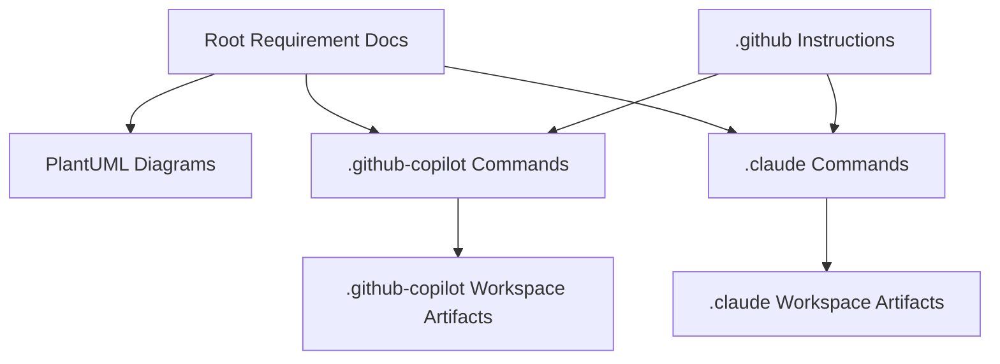

# 02 - Module Map

## Scope
- Mục tiêu: mô tả module hiện có trong repo và quan hệ phụ thuộc ở mức brownfield discovery.

## Fact
- Repo bao gồm 4 nhóm module chính:
  - Governance & instructions: `.github/`
  - Copilot runtime workflow: `.github-copilot/`
  - Claude runtime workflow: `.claude/`
  - Product design artifacts: `docs/plantuml/` + tài liệu gốc ở thư mục root
- Chưa có module source runtime của web app (không thấy cây file PHP thực thi như trong đặc tả).

## Module Responsibilities
- `.github/`: chat customization, instructions, prompt, policy hooks.
- `.github-copilot/`: commands, agents, templates, workspace artifacts để vận hành Agentic Software Team.
- `.claude/`: bộ tương đương cho Claude runtime.
- `docs/plantuml/`: ERD + use-case diagrams thể hiện domain và rule nghiệp vụ.
- Root docs (`DAC-TA-UNG-DUNG.md`, `Yeu-cau-project.md`, ...): yêu cầu và định hướng triển khai.

## Dependency Graph (Conceptual)

## Entry Points Observed
- Human-triggered slash commands trong `.github-copilot/commands/` và `.claude/commands/`.
- Tài liệu domain trong `docs/plantuml/` là nguồn nghiệp vụ chính để suy ra behavior.

## Gaps
- Chưa có entry point runtime ứng dụng web như `index.php`, API controller hoặc routing thực tế.
